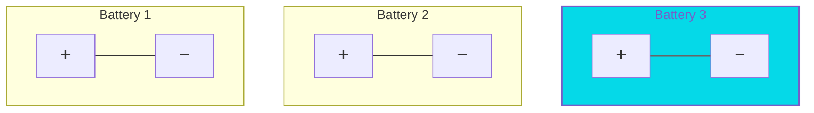

```mermaid
flowchart TB

    subgraph Battery1["Battery 3"]
        a1[➕] --- a2[➖]
    end

    subgraph Battery2["Battery 2"]
        b1[➕] --- b2[➖]
    end

    subgraph Battery3["Battery 1"]
        c1[➕] --- c2[➖]
    end

    style Battery1 fill:#05d9e8,stroke:#785dc8,stroke-width:2px,color:#785dc8
    style Battery1 fill:#05d9e8,stroke:#785dc8,stroke-width:2px,color:#785dc8
    style Battery1 fill:#05d9e8,stroke:#785dc8,stroke-width:2px,color:#785dc8
    linkStyle 0 stroke:#666,stroke-width:2px
```